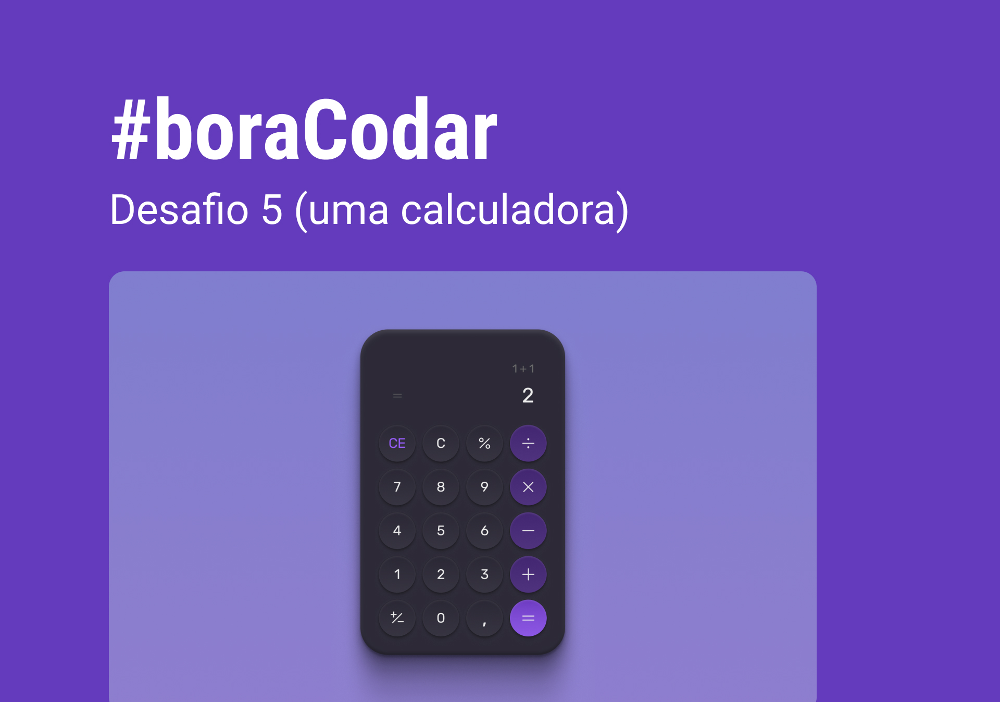

<h1 align="center"> Calculator </h1>

  <a href="#-tecnologias">Tecnologias</a>&nbsp;&nbsp;&nbsp;|&nbsp;&nbsp;&nbsp;
  <a href="#-projeto">Projeto</a>&nbsp;&nbsp;&nbsp;|&nbsp;&nbsp;&nbsp;
  <a href="#-layout">Layout</a>&nbsp;&nbsp;&nbsp;|&nbsp;&nbsp;&nbsp;
  <a href="#memo-licença">Licença</a>

  

 

 

## 🚀 Tecnologias

Esse projeto foi desenvolvido com as seguintes tecnologias:

- HTML
- CSS
- JavaScript
- Git e Github
- Figma

## 💻 Projeto

O calculator é um app de Calculadora trazendo um Desing mais elegante.

- [Acesse o projeto finalizado, online](#)

## 🔖 Layout

Você pode visualizar o layout do projeto através [DESSE LINK](https://www.figma.com/community/file/1202607074523509182).

## :memo: Licença

Esse projeto está sob a licença MIT.

---

Feito com ♥ by Ana Luisa Santos